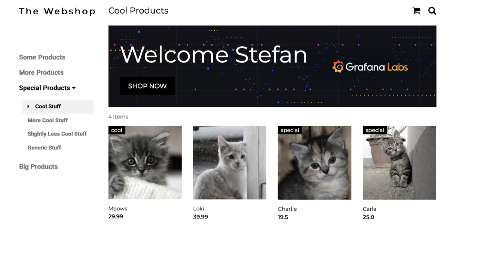
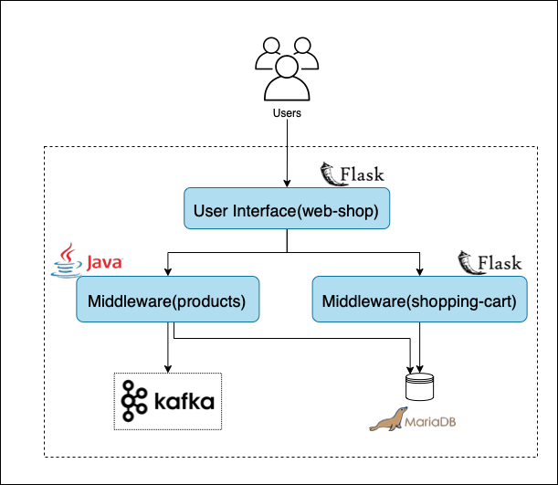
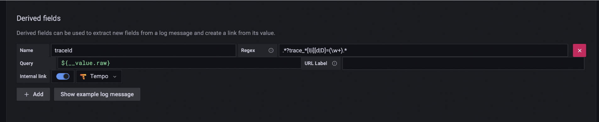
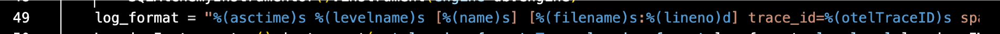
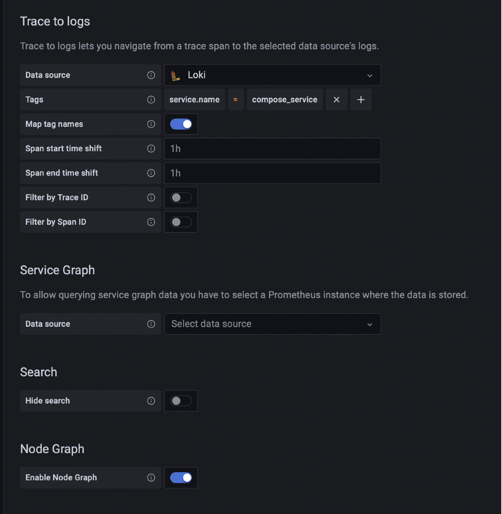
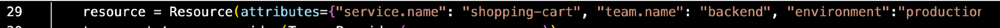

# Zero to Observable in < 30 Min

## Demo Objective

This workshop will walk you through how to collect and visualize metrics, logs and traces from your distributed microservice application.

## Prerequisites
[Sign up for our free Grafana Cloud Account](https://grafana.com/)

[GCP Cloud Account](https://cloud.google.com)

Optional: Download a Text Editor (ex: [Visual Studio Code](https://code.visualstudio.com/download))

## Application Overview
This demo spins up a simplified containerized "web shop" application.



The application consists of 5 microservices:
- web-shop: a user interface that allows you to add items to a shopping cart, as well as delete all items in the shopping cart.
- shopping-cart: a backend service that interacts with a MariaDB instance. It persists the shopping cart items of the different users.
- products: a backend service that serves the available products of the web shop.
- mariadb: A mariadb instance to persist products and shopping cart items.
- shopping cart simulator: a service that simulates light user traffic by adding things to the shopping cart via the web-shop API.
- broker: a kafka broker to persist checked out shopping carts before they are reset.



#### Architecture Overview
- The web shop UI is a Python Flask service that renders 2 HTML pages: 
    - landing page- loads products by requesting them from the products API
    - shopping cart view- interacts with the shopping cart service to get the current shopping cart items from the user
- The shopping cart service is written in Flask and offers an API to interact with MariaDB
- The products service is written in Java Spring Boot and offers an API to load the currently available shop items from MariaDB
- The products service has a Kafka producer and consumer implemented:
    - The producer- sends the content of the shopping cart as JSON to a Kafka topic
    - The consumer- logs the message

## Part 0: Setup Prior to Workshop
We will be using [Cloud Shell](https://cloud.google.com/shell) to run this workshop. Cloud Shell is a GCP offering and allows you to manage your cloud resources via terminal. As well it comes preloaded with the utilites you will be using today: kubectl, curl, and envsubst

### Setting up your IDE 

You will start off by opening up Cloud Shell. This can take a minute depending on when the last time you used it was.

Once it is open you will run the following commands to pull the repo from GitHub:

***Ctrl + v does not work in cloud shell. You must use Ctrl + Shift + v or right click -> paste
```bash
git clone https://github.com/Mkrummz/mtl_docker.git
cd mtl_demo
```
Set the Env Variables

```bash
#select the geographic deployment location
#https://cloud.google.com/compute/docs/regions-zones (ex: europe-north1-a, us-central1-a)
zone=us-central1-c

#give the cluster a name
clustername=web-shop-app

#define the Container Namespace.
#DO NOT MODIFY unless you also modify web-shop-app.yaml
namespace=web-shop-app

#input your first name (or initals)
owner=mmk

#the date you expect to delete the cluster by
deletedate=07-29-2022
```

### Deploying your Cluster 

Spin up a GKE cluster
```bash
gcloud container clusters create --zone ${zone} ${clustername} --labels owner=${owner},lifetime=${deletedate}
```

Get Cluster Credentials
```bash
gcloud container clusters get-credentials ${clustername} --zone ${zone}
```

Deploy App
```bash
kubectl apply -f web-shop-app.yaml
```

Check to see if all containers are all in the ready state
```bash
kubectl get deployments --all-namespaces
```

If yes, the set up a port-forwarder for the products container
```bash
#get container name, choose one that start with productsXXXX
kubectl get pod -n ${namespace}
```

```bash
#input it in here
#example kubectl port-forward -n ${namespace} products-7cf9db6b6-splt5 8080:8080
kubectl port-forward -n ${namespace} <_pod_name_> 8080:8080
```

While that is running open a new terminal and run the curl commands to populate the store front
```bash
cd mtl_demo
sh ./load_store.sh
```
Now kill the port forwarding process on the other temrinal (control + c) we no longer need that

If control+ c didnt work you can run the following
```bash
jobs
kill %1
jobs
```
if successful you should no longer see any jobs running

Next grab the website URL
```bash
kubectl get -n ${namespace} service web-shop
```
Naviagate to the URL: http://<_hostname or public ip_>:3389/shop?name=User

Congrats you have completed the workshop setup steps!

## Part 1: Instrumentation and Collection of Metrics Data and Logs
You will start off by instrumenting our application. Using the architecture diagram from above you will leverage the cloud integration and connections to quickly orchestrate the collection of the telemetry data.

Once instrumented, you will be sending this telegemery data to [Grafana Cloud](https://grafana.com/products/cloud/?pg=blog&plcmt=body-txt) (fully-managed composable observability platform) via the Grafana Agent (all-in-one agent for collecting metrics, logs, and traces).

The Grafana Agent supports configuring multiple independent “subsystems.” Each subsystem helps you collect data for a specific type of telemetry.

### Integrations subsystem

The [integrations_config](https://grafana.com/docs/agent/latest/configuration/integrations/) block configures how the Agent runs integrations that scrape and send metrics without needing to run specific Prometheus exporters or manually write scrape_configs.

You still have full control over how the exporter is configured in the agent configuration file allowing us to select which collectors we want enabled. For example, you may want to disabled the mdadm collector for the node_exporter.

### Metrics subsystem

The metrics_config block is used to define a collection of metrics instances. Each instance defines a collection of Prometheus-compatible scrape_configs and remote_write rules.

Logs follow the same pattern.

To implement this we will go to Grafana Cloud and open up the integrations section and search for Kubernetes. Then we will follow the guide to set it up.


## Part 2: Instrumentation and Collection of Trace Data
Traces subsystem allows you to collect spans to send to Grafana Tempo. Grafana Agent collects traces and forwards them to Tempo using its traces subsystem. This is done using the upstream [OpenTelemetry Collector](https://github.com/open-telemetry/opentelemetry-collector). Grafana Agent can ingest OpenTelemetry, OpenCensus, Jaeger, Zipkin, or Kafka spans. 

```yml
configs:
 - name: latencyEndpoint
   remote_write:
     - endpoint: <Tempo compatible remote write's API>
       basic_auth:
         username: <user name or instance ID if using Grafana Cloud>
         password: <password or API Key if using Grafana Cloud>
   receivers:
     otlp:
       protocols:
         grpc:
         http:
   spanmetrics:
     dimensions:
       - name: http.method
       - name: http.target
       - name: team.name
     handler_endpoint: 0.0.0.0:1234
```

### Enable Logging in the Microservices:

#### Shopping-cart microservice (backend API)
Python code can be auto-instrumented with OpenTelemetry libraries. It is added at initialization time in [shopping-cart/wsgi.py]() file (lines 8-20):

``` py
from prometheus_flask_exporter import PrometheusMetrics
from opentelemetry import trace
from opentelemetry.sdk.trace import TracerProvider
from opentelemetry.sdk.trace.export import (
    ConsoleSpanExporter,
    SimpleSpanProcessor,
)
from opentelemetry.sdk.trace.export import BatchSpanProcessor
from opentelemetry.exporter.otlp.proto.grpc.trace_exporter import OTLPSpanExporter
from opentelemetry.sdk.resources import Resource
from opentelemetry.instrumentation.flask import FlaskInstrumentor
from opentelemetry.instrumentation.requests import RequestsInstrumentor
from opentelemetry.instrumentation.logging import LoggingInstrumentor
from opentelemetry.instrumentation.wsgi import OpenTelemetryMiddleware
```

and then add the following to lines 27-49

```py
@postfork
def init_tracing():
    resource = Resource(attributes={"service.name": "web-shop", "team.name": "frontend", "environment":"production"})
    trace.set_tracer_provider(TracerProvider(resource=resource))
    otlp_exporter = OTLPSpanExporter(endpoint=environ.get("OTEL_EXPORTER_OTLP_ENDPOINT"), insecure=True)
    span_processor = BatchSpanProcessor(otlp_exporter)
    trace.get_tracer_provider().add_span_processor(span_processor)

    # uncomment for local OTel debugging to get traces/span to console:
    #trace.get_tracer_provider().add_span_processor(SimpleSpanProcessor(ConsoleSpanExporter()))

    # be careful not to call this line before the paragraph above!
    # getting the tracer explicitly is only required for the LoggingInstrumentor below
    # using "opentelemetry-instrument" to do auto instrumentation does not work either for the same reason
    tracer = trace.get_tracer(__name__)

    # instrumentation
    PrometheusMetrics(app)
    FlaskInstrumentor().instrument_app(app)
    app.wsgi_app = OpenTelemetryMiddleware(app.wsgi_app)
    RequestsInstrumentor().instrument()
    log_format = "%(asctime)s %(levelname)s [%(name)s] [%(filename)s:%(lineno)d] trace_id=%(otelTraceID)s span_id=%(otelSpanID)s resource.service.name=%(otelServiceName)s - %(message)s"
    LoggingInstrumentor().instrument(set_logging_format=True, logging_format=log_format, log_level=logging.INFO, tracer_provider=tracer)
```

#### Shopping-cart microservice (backend API)

Python code can be auto-instrumented with OpenTelemetry libraries. It is added at initialization time in [web-shop/wsgi.py]() file (lines 7-20):

``` py
from prometheus_flask_exporter import PrometheusMetrics
from opentelemetry import trace
from opentelemetry.sdk.trace import TracerProvider
from opentelemetry.sdk.trace.export import (
    ConsoleSpanExporter,
    SimpleSpanProcessor,
)
from opentelemetry.sdk.trace.export import BatchSpanProcessor
from opentelemetry.exporter.otlp.proto.grpc.trace_exporter import OTLPSpanExporter
from opentelemetry.sdk.resources import Resource
from opentelemetry.instrumentation.flask import FlaskInstrumentor
from opentelemetry.instrumentation.sqlalchemy import SQLAlchemyInstrumentor
from opentelemetry.instrumentation.logging import LoggingInstrumentor
from opentelemetry.instrumentation.wsgi import OpenTelemetryMiddleware

```

and then add the following to lines 27-51

```py
@postfork
def init_tracing():
    resource = Resource(attributes={"service.name": "shopping-cart", "team.name": "backend", "environment":"production"})
    trace.set_tracer_provider(TracerProvider(resource=resource))
    otlp_exporter = OTLPSpanExporter(endpoint=environ.get("OTEL_EXPORTER_OTLP_ENDPOINT"), insecure=True)
    span_processor = BatchSpanProcessor(otlp_exporter)
    trace.get_tracer_provider().add_span_processor(span_processor)

    # uncomment for local OTel debugging to get traces/span to console:
    #trace.get_tracer_provider().add_span_processor(SimpleSpanProcessor(ConsoleSpanExporter()))

    # be careful not to call this line before the paragraph above!
    # getting the tracer explicitly is only required for the LoggingInstrumentor below
    # using "opentelemetry-instrument" to do auto instrumentation does not work either for the same reason
    tracer = trace.get_tracer(__name__)

    # instrumentation
    PrometheusMetrics(app)
    FlaskInstrumentor().instrument_app(app)
    app.wsgi_app = OpenTelemetryMiddleware(app.wsgi_app)
    with app.app_context():
        SQLAlchemyInstrumentor().instrument(engine=db.engine)
    log_format = "%(asctime)s %(levelname)s [%(name)s] [%(filename)s:%(lineno)d] trace_id=%(otelTraceID)s span_id=%(otelSpanID)s resource.service.name=%(otelServiceName)s - %(message)s"
    LoggingInstrumentor().instrument(set_logging_format=True, logging_format=log_format, log_level=logging.INFO, tracer_provider=tracer)
```

## Create new Datasources
You will need to create a new Loki, and Tempo Data Source as you cannot change the ones that were automatically provisioned.

### Logs to Traces correlation datasource setup:
Traceid is in the log line.

#### Data Source Configuration
name =  ``` traceid ```

regex = ``` .*?trace_*[I|i][d|D]=(\w+).* ```

internal link = tracing



We got these values from: line 49 of shopping-cart/wsgi.py and line 48 of web-shop/wsgi.py



### Traces to Logs correlation setup:
Loki can recieve a set of labels along with log line. These labels are used to index log entries and query. By default the Docker driver will add:
- filename: where the log is written to on disk
- host: the hostname where the log has been generated
- swarm_stack, swarm_service: added when deploying from Docker Swarm
- compose_project, compose_service: added when deploying with Docker Compose

#### Data Source Configuration
Data source =  ``` Loki ```

Tags = ```bash service.name ``` = ``` compose_service ```

Toggle on **Map tag names** and **Enable Node Graph**



We got these values from: line 29 of shopping-cart/wsgi.py and line 29 of web-shop/wsgi.py



## Go to Explore 
CPU Usage by Service
sum(node_namespace_pod_container:container_cpu_usage_seconds_total:sum_irate{cluster="cloud", namespace="web-shop-app"} * on(namespace,pod)   group_left(workload, workload_type) namespace_workload_pod:kube_pod_owner:relabel{cluster="cloud", namespace="web-shop-app"} ) by (workload, workload_type)

then you can add it to a dashboard

then click the panel and show some of the options for customization such as changing the legend 

## Adding Additional Dashboards

### User Experience Dashboards
We can use **Synthetic Monitoring** for this. The synthetic monitoring module in Grafana Cloud is a black box monitoring solution that allows you to extract information about the behavior of applications and services from an outside perspective. You can run remote tests on these applications or services from different locations around the world in such a way that you can identify their availability.  In each check, the metrics and logs that are collected are saved within the metrics and logs backend of the stack itself. Meaning you can access them directly via a Prometheus query with PromQL or a Loki query with LogQL.

You can do checks such as Ping via ICMP, HTTP and HTTPS websites, DNS name resolution check, TCP connections, and recently  we added a new type of check, traceroute. Traceroute checks show routes through network to a target. Check out packet loss, hop distance, and timing from any synthetic monitoring probe.

To set this up:
1. navigate to your grafana cloud instance
2. click on synthetic monitoring on the left hand side (world icon)
3. click on **Checks** in the naviagation bar
4. click add new check
5. Set **Check type** to **HTTP**, give the **Job a Name**, Put <gke_public_ip>:3389/shop?name=User as the **target**, select any **probe locations** you'd like (I'd recommend doing >3), and select **Save**.
   - For a more interesting probe set up another one with <gke_public_ip>:3389/cart?name=Jim&checkout=true
   - If you want to do a traceroute use grafanalivedemo.com
6. Then click **View Dashboard** (I'd recommend having one running already and after walking through the setup steps opening that one so its populated with data)

### Import Additional Example Dashboard in the Dashboard Folder

From there you can do so much: 
- https://play.grafana.org/d/T512JVH7z/loki-nginx-service-mesh-json-version?orgId=1 - all the stuff you can do with just logs 
- https://se-demo.grafana.net/d/Oc_5E1snz/web-app-observability-mk?orgId=1 - templatized data across web apps or even deployments
- https://sedemo.grafana.net/d/lB_AxvX7k/k6-integration-dashboard-mk?orgId=1&from=1651574259000&to=1651574667000 - data about your load testing
- https://se-demo.grafana.net/d/RP60OMfZf/servicenow-incidents?orgId=1 - tie in data from your ticketing system 
- https://se-demo.grafana.net/d/0qrJzvL7z/0-ddr-elk-metrics-logs-tracces?orgId=1 - big tent philosphy 
- https://sedemo.grafana.net/d/8BuVGzTMk/k8s-slos-with-error-budget?orgId=1&var-datasource=grafanacloud-sedemo-prom&var-cluster=&var-- instance=All&from=now-3h&to=now - use tools such as sloth slo
- https://se-demo.grafana.net/d/KZI2_9s7k/devops-scorecard?orgId=1 - devops score cards, send them out as pdfs in weekly reports
- https://se-demo.grafana.net/d/L-XLdvY7k/0-ddr-ml?orgId=1 - ml

all of this in one place as your first pane of glass

Navigation Dashboard

## Spin Down the Env
1. Delete the probs you created in Synthetic Monitoring
2. To delete your GKE cluster run:
    ```bash
    gcloud container clusters delete ${clustername} --zone=${zone}
    ```

## Acknowledgements

[Web Shop Observability](https://github.com/Condla/web-shop-o11y-demo) was created by Stefan Dunkler

Adapted from a [workshop](https://docs.google.com/presentation/d/1TWWFg1j-Inu4aoWzY63m9KQAKBzIwOH9hKPTSTol7Qk/edit#slide=id.g135b07445ea_0_142) put together by Raúl Marín 
